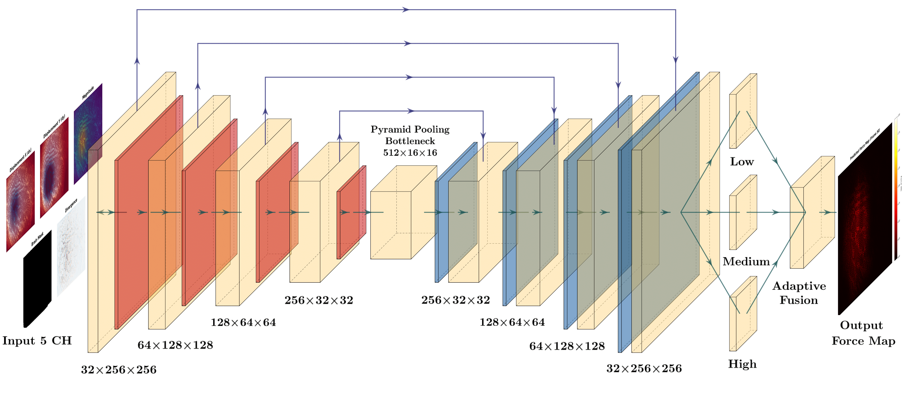

# D2FNet

**D2FNet** (Deformation-to-Force Network) predicts spatially resolved contact force magnitude on the brain surface from 2D displacement fields. It is the learning component paired with **[SOFA-NeuroSim-Recorder](https://github.com/D3MIA/SOFA-NeuroSim-Recorder)**, which generates supervised simulation datasets from SOFA FEM brain models.

Given multi-channel 256×256 grids built from surface displacements, D2FNet outputs a per-pixel force map in the neurosurgical force range (0–3 N).

---

## Overview

| | |
|---|---|
| **Input** | 5-channel spatial grid: normalized dx, dy, magnitude, brain mask, divergence |
| **Output** | 256×256 force magnitude map (denormalized to Newtons) |
| **Architecture** | Multi-scale U-Net with attention, pyramid pooling, adaptive multi-head fusion |
| **Loss** | Hybrid R² + anti-ghost penalty (asymmetric weight on low-force over-predictions) |
| **Training** | 3-fold cross-validation, AdamW, gradient clipping |

**Data pipeline:** simulate and export 2D datasets with SOFA-NeuroSim-Recorder → train with `d2fnet/train.py` → run inference with `d2fnet/tools/inference.py`.

---

## Quick Start

**Requirements:** Python 3.10+, CUDA-capable GPU recommended

```bash
pip install -r requirements.txt
```

Place 2D dataset NPZ files (from SOFA-NeuroSim-Recorder `build_2d_datasets.py`) under `datasets_2d_modified/`:

```text
datasets_2d_modified/
└── run_E{E}_nu{nu}_seed{seed}/
    └── brain_surface_*_2d.npz
```

**Train (3-fold cross-validation):**

```bash
cd d2fnet
python train.py --data_dir ../datasets_2d_modified
```

**Train a single fold:**

```bash
python train.py --data_dir ../datasets_2d_modified --fold 2
```

**Inference:**

```bash
python tools/inference.py --model models/best_model_fold_2.pth --data_dir ../datasets_2d_modified
```

Checkpoints are saved to `d2fnet/models/` (`best_model_fold_*.pth`, `history_fold_*.pkl`, `cv_results.pkl`).

---

## Architecture

D2FNet is a U-Net encoder–decoder with multi-scale attention at each stage, pyramid pooling in the bottleneck, and three specialized output heads (low / medium / high force regimes) fused via learned attention weights.

<p align="center">
  
  <br/>
  <em>D2FNet — multi-scale U-Net with attention, pyramid pooling, and adaptive force-head fusion.</em>
</p>

```text
Input (5, 256, 256)
  → Encoder + MultiScaleAttention (4 levels)
  → Bottleneck + PyramidPooling [1×1, 2×2, 4×4, 8×8]
  → Decoder with skip connections
  → Low / Med / High force heads → adaptive fusion
  → Output (1, 256, 256)
```

| Component | File |
|-----------|------|
| Model | `d2fnet/model.py` |
| Loss | `d2fnet/loss.py` |
| Dataset & grid builder | `d2fnet/dataset.py` |
| Training | `d2fnet/train.py` |
| Inference & overlays | `d2fnet/tools/inference.py` |

**Input channels**

| # | Channel | Description |
|---|---------|-------------|
| 1 | dx / scale | Normalized horizontal displacement |
| 2 | dy / scale | Normalized vertical displacement |
| 3 | magnitude | Clipped displacement magnitude |
| 4 | brain mask | Binary craniotomy / surface mask |
| 5 | divergence | Smoothed ∂dx/∂x + ∂dy/∂y |

Scales are computed from training-set P99.9 statistics. Forces are normalized by 3.0 N during training and denormalized at inference.

---

## Training Configuration

| Parameter | Value |
|-----------|-------|
| Epochs | 50 |
| Batch size | 8 |
| Learning rate | 5×10⁻⁴ |
| Optimizer | AdamW (weight decay 10⁻⁵) |
| Scheduler | ReduceLROnPlateau (factor 0.5, patience 5) |
| Gradient clipping | 1.0 |
| Loss weights | 30% R² + 70% anti-ghost (3× penalty below 0.05 N) |

---

## Results (3-fold cross-validation)

Reported on simulated datasets from SOFA-NeuroSim-Recorder:

| Fold | R² | MAE (N) |
|------|-----|---------|
| 1 | 0.757 | 0.0065 |
| 2 | 0.843 | 0.0053 |
| 3 | 0.763 | 0.0074 |
| **Mean ± std** | **0.788 ± 0.039** | **0.0064 ± 0.0008** |

Anti-ghost training reduced spurious high-force predictions in low-force regions compared to standard MSE (see paper).

<p align="center">
  <video src="docs/videos/experimental_force_heatmap.mp4" width="720" controls>
    Your browser does not support the video tag.
  </video>
  <br/>
  <em>Example — predicted force heatmap overlaid on simulated brain surface deformation.</em>
</p>

---

## Repository Structure

```text
D2FNet/
├── docs/
│   ├── images/d2fnet_architecture.png
│   └── videos/experimental_force_heatmap.mp4
├── d2fnet/
│   ├── model.py              # D2FNet architecture
│   ├── loss.py               # ImprovedAdaptiveR2Loss
│   ├── dataset.py            # StableSpatialDataset
│   ├── train.py              # 3-fold CV training
│   ├── tools/inference.py    # Prediction & overlay generation
│   └── models/               # Checkpoints (Git LFS)
├── requirements.txt
└── README.md
```

Pre-trained weights in `d2fnet/models/` are tracked with **Git LFS**.

---

## Related Projects

| Repository | Role |
|------------|------|
| **[SOFA-NeuroSim-Recorder](https://github.com/D3MIA/SOFA-NeuroSim-Recorder)** | SOFA simulation, recording, and 2D dataset export |

