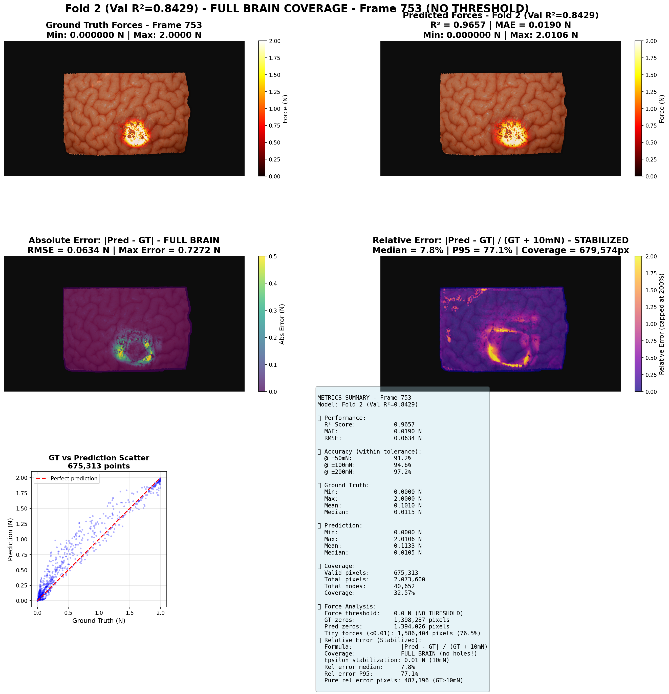

# BrainForces - Force Prediction System

**Advanced system for predicting forces on brain surface from 2D displacement data**

---

## Table of Contents

1. [Overview](#overview)
2. [Data Architecture](#data-architecture)
3. [Implemented Models](#implemented-models)
4. [Training Pipelines](#training-pipelines)
5. [Usage](#usage)
6. [Results](#results)

---

##  Overview

This project develops force prediction models on the brain surface from spatiotemporal displacement data. Two complementary approaches are implemented:

### Modeling Approaches

1. **CNN Approach (Deep Learning)**: U-Net convolutional neural network with hybrid loss function optimizing R² while reducing ghost artifacts
2. **Gradient Boosting Approach**: Ensemble of LightGBM models with 32 advanced features extraction and 3-fold cross-validation

### Scientific Objective

Accurately predict force magnitudes (in Newtons) applied on each brain surface node, accounting for:
- Temporal dynamics of displacements
- Spatial deformation patterns
- Low force zones (< 0.05N) particularly sensitive to artifacts

---

##  Data Architecture

### Dataset Format

Data is stored in `.npz` files with the following structure:

```python
# NPZ file structure
{
    'disp2d': np.ndarray,      # Shape: (n_timesteps, n_nodes, 2)
                               # 2D displacements (dx, dy) in millimeters
    
    'force_mag': np.ndarray,   # Shape: (n_timesteps, n_nodes)
                               # Force magnitude in Newtons
}
```

### Data Characteristics

> **Data Generation**: All datasets were generated using the SOFA-based simulation pipeline documented in the [Sofa-Simulation-Recorder](https://github.com/D3MIA/Sofa-Simulation-Recorder) repository. This pipeline allows for reproducible brain surface simulation data generation with customizable parameters.


| Property | Description |
|----------|-------------|
| **Nodes** | ~40,652 nodes per surface  |
| **Timesteps** | We have 2000 per dataset |
| **Displacements** | Coordinates (x, y) in mm, normalized by P99.9 (~5-6 mm) |
| **Forces** | Magnitude in Newtons, normalized by 3.0N | 

### Dataset Organization

```
datasets_2d_modified/
├── run_seed_1111/
│   └── brain_surface_<hash>_auto_projected_<hash>_2d.npz
├── run_seed_1200/
│   └── brain_surface_<hash>_auto_projected_<hash>_2d.npz
├── ...
└── run_seed_9999/
    └── brain_surface_<hash>_auto_projected_<hash>_2d.npz
```

**19 total datasets**: `run_seed_1111`, `1200`, `1324`, `2004`, `2191`, `2222`, `321`, `3333`, `4444`, `4509`, `5555`, `6666`, `6842`, `7777`, `789`, `8888`, `960`, `9806`, `9999` were used for the training/Validation at a ratio of 13/6 (70/30).

### Data Preprocessing for CNN only

#### Robust Normalization (P99.9)

```python
# Displacements
dx_normalized = dx / dx_scale    # dx_scale = P99.9(|dx|) 
dy_normalized = dy / dy_scale    # dy_scale = P99.9(|dy|)

Les scales seront sauvegardés dans les checkpoints.

# Forces
force_normalized = force / 3.0   # Fixed normalization at 3.0N
```
#### Spatial Filtering

- **Brain mask**: Excludes pixels outside brain surface (97.8% active pixels)
- **Right border filtering**: Excludes nodes with X > 1400 mm (15.1% nodes filtered)
- **Final valid nodes**: ~34,516 nodes (84.9% of total)

##  Implemented Models

### 1. CNN Approach (Deep Learning)

**Base Architecture**: AdvancedUNet with Multi-Scale Attention

We use an advanced U-Net architecture enhanced with multi-scale attention mechanisms and pyramid pooling. The network takes multi-channel images representing displacements and positions as input, and predicts force magnitude at each point through adaptive multi-scale fusion.

```
Input: (batch, 5, 256, 256)
  ↓
Encoder with Attention:
  Conv(5→32) + BN + ReLU + MultiScaleAttention + Dropout → skip1 (256×256)
  MaxPool → (128×128)
  Conv(32→64) + BN + ReLU + MultiScaleAttention + Dropout → skip2 (128×128)
  MaxPool → (64×64)
  Conv(64→128) + BN + ReLU + MultiScaleAttention + Dropout → skip3 (64×64)
  MaxPool → (32×32)
  Conv(128→256) + BN + ReLU + MultiScaleAttention + Dropout → skip4 (32×32)
  MaxPool → (16×16)
  ↓
Bottleneck with Pyramid Pooling:
  Conv(256→512) + BN + ReLU + MultiScaleAttention
  PyramidPooling(512→512) [1×1, 2×2, 4×4, 8×8 scales]  → (16×16)
  ↓
Decoder with Skip Connections:
  ConvTranspose(512→256) + Concat(skip4) + Conv(512→256) + Attention
  ConvTranspose(256→128) + Concat(skip3) + Conv(256→128) + Attention
  ConvTranspose(128→64) + Concat(skip2) + Conv(128→64) + Attention
  ConvTranspose(64→32) + Concat(skip1) + Conv(64→32) + Attention
  ↓
Multi-Scale Output Heads:
  Conv(32→16) → features
  ├─ Low Force Head:  Conv(16→1) × sigmoid × 0.5  [0-0.5N]
  ├─ Med Force Head:  Conv(16→1) × sigmoid × 1.5  [0-1.5N]
  └─ High Force Head: Conv(16→1) × sigmoid × 3.0  [0-3.0N]
  ↓
Adaptive Fusion:
  FusionAttention(3→3) → softmax weights
  Weighted sum of 3 heads → (batch, 1, 256, 256)
```

**Key Components**:
- **MultiScaleAttention**: Spatial + Channel attention for different force scales
- **PyramidPooling**: Multi-scale context aggregation (1×1, 2×2, 4×4, 8×8)
- **Multi-Scale Heads**: Separate branches for low/medium/high force prediction
- **Adaptive Fusion**: Learned fusion weights to combine predictions optimally

**Model Size**: 13.08M trainable parameters (~50 MB)

**File**: `CNN_approach/advanced_r2_model.py`

#### Input Data Representation

To enable the neural network to learn spatial patterns, we transform irregular displacement data (non-uniform nodes) into regular 256×256 pixel images via bilinear interpolation.

**5 spatial information channels**:

| Channel | Description | Formula |
|---------|-------------|---------|
| 1 | Normalized X displacement | `dx / dx_scale` |
| 2 | Normalized Y displacement | `dy / dy_scale` |
| 3 | Displacement magnitude | `sqrt(dx² + dy²) / dx_scale` |
| 4 | Brain mask | Binary mask (1=brain, 0=outside) |
| 5 | Displacement field divergence | `∂dx/∂x + ∂dy/∂y` (spatially smoothed) |

**Grid size**: 256×256 pixels (bilinear interpolation of irregular nodes)

#### Model Output

The network produces a spatial prediction map:

- **Format**: 256×256 image with 1 channel
- **Values**: Normalized force magnitude (between 0 and ~1)
- **Post-processing**: Denormalization `force_pred = output × 3.0` to get forces in Newtons

#### Loss Function: Hybrid R²-AntiGhost Loss

**Identified Problem**: Classical loss functions (MSE, MAE) optimize the mean error but don't guarantee good coefficient of determination (R²) that actually proved its efficiency in validating spatial patterns. Moreover, they can produce **ghost artifacts**: high force predictions in zones where actual forces are very low.

**Our Solution**: A hybrid loss function combining two objectives:

1. **Direct R² Optimization**: Maximize correlation between predictions and ground truth
2. **Anti-ghost Penalty**: Heavily penalize errors in low force zones

**Implementation**:

```python
class ImprovedAdaptiveR2Loss:
    def __init__(self, r2_weight=0.3, ghost_penalty=3.0, low_force_threshold=0.05):
        """
        Args:
            r2_weight: R² term weight (0.3 = 30% R², 70% AntiGhost)
            ghost_penalty: Penalty factor on low force zones (×3)
            low_force_threshold: Threshold defining "low force" (0.05N = 0.0167 normalized)
        """
```

**Mathematical Formula**:

```
Loss = r2_weight × L_R² + (1 - r2_weight) × L_ghost

where:
  L_R² = 1 - R²(y_true, y_pred)
  
  L_ghost = mean(w × (y_pred - y_true)²)
  
  w = {
    ghost_penalty  if y_true < threshold  (low force zones)
    1.0           otherwise
  }
```

**Advantages of this approach**:
-  Directly optimizes performance metric (R²)
-  Drastically reduces ghost artifacts (parasitic over-predictions)
-  Penalizes errors ×3 in critical zones (low forces < 0.05N)
-  Automatic balance between global accuracy and local quality

**File**: `CNN_approach/anti_ghost_loss.py`

#### Training Configuration

**Parameters**:
```python
EPOCHS = 50
BATCH_SIZE = 8
LEARNING_RATE = 0.0005
OPTIMIZER = AdamW (weight_decay=1e-5)
SCHEDULER = ReduceLROnPlateau (factor=0.5, patience=5)
GRADIENT_CLIPPING = 1.0
```

**3-fold Cross-validation**:

| Fold | Train datasets (13) | Val datasets (6) |
|------|---------------------|------------------|
| 1 | 1324, 2004, 2191, 2222, 321, 3333, 4444, 4509, 6842, 7777, 789, 8888, 9999 | 1111, 1200, 5555, 6666, 960, 9806 |
| 2 | 1111, 1200, 2004, 2191, 2222, 321, 4444, 5555, 6666, 789, 960, 9806, 9999 | 1324, 3333, 4509, 6842, 7777, 8888 |
| 3 | 2004, 1200, 1324, 3333, 4444, 4509, 5555, 6666, 6842, 7777, 321, 960, 9806 | 1111, 2191, 2222, 8888, 789, 9999 |

**Validation Metrics**:
- **R² score**: Coefficient of determination (primary target)
- **MAE**: Mean Absolute Error in Newtons
- **Loss**: ImprovedAdaptiveR2Loss

**Files**:
- Training script: `CNN_approach/train_cnn.py`
- Dataset loader: `CNN_approach/spatial_cnn_ultra_stable.py`
- Model architecture: `CNN_approach/advanced_r2_model.py`
- Loss function: `CNN_approach/anti_ghost_loss.py`

---

### 2. Gradient Boosting Approach (LightGBM)

**Philosophy**: Instead of automatically learning features (like CNN), we manually extract 32 advanced features characterizing spatiotemporal dynamics, then train an ensemble of LightGBM models.

#### Feature Extraction (Feature Engineering)

**Vectorized extraction on displacement time series**:

We compute for each node and each timestep a set of 32 features capturing:
- **Kinematics**: Positions, displacements, velocities, accelerations, jerk
- **Geometry**: Angles, curvatures, distances
- **Energies**: Kinetic and potential energy proxies
- **Statistics**: Temporal means and standard deviations

```python
def extract_ultra_advanced_features(positions):
    """
    Input: positions (n_timesteps, n_nodes, 2)
    Output: features (n_nodes × n_timesteps, 32)
    """
```

**List of 32 features**:

| # | Feature | Description | Computation |
|---|---------|-------------|-------------|
| 1-2 | `dx`, `dy` | Displacements | `positions[:,:,0/1]` |
| 3 | `disp_mag` | Displacement magnitude | `sqrt(dx² + dy²)` |
| 4 | `disp_angle` | Displacement angle | `atan2(dy, dx)` |
| 5-6 | `sin(angle)`, `cos(angle)` | Angular components | Trigonometry |
| 7-8 | `dx²`, `dy²` | Squared displacements | Powers |
| 9 | `time_norm` | Normalized time | `t / n_timesteps` |
| 10-12 | `vel_x`, `vel_y`, `vel_mag` | Velocity | `diff(positions)` |
| 13-15 | `acc_x`, `acc_y`, `acc_mag` | Acceleration | `diff(velocity)` |
| 16 | `disp_mag²` | Squared magnitude | `disp_mag²` |
| 17-18 | `time²`, `time³` | Polynomial time | Powers |
| 19-20 | `vel_angle`, `vel_angle_change` | Velocity direction | `atan2`, `diff` |
| 21-23 | `jerk_x`, `jerk_y`, `jerk_mag` | Jerk (accel derivative) | `diff(acceleration)` |
| 24 | `curvature` | Trajectory curvature | `abs(vx×ay - vy×ax) / vel³` |
| 25 | `dist_origin` | Distance to origin | `sqrt(x² + y²)` |
| 26 | `angle_origin` | Angle from origin | `atan2(y, x)` |
| 27 | `kinetic_proxy` | Kinetic energy proxy | `0.5 × vel²` |
| 28 | `potential_proxy` | Potential energy proxy | `dist_origin` |
| 29 | `disp_mag_std` | Displacement std dev | `std(disp_mag, axis=0)` |
| 30 | `vel_mag_mean` | Velocity mean | `mean(vel_mag, axis=0)` |
| 31-32 | `sin(angle_origin)`, `cos(angle_origin)` | Angular position | Trigonometry |

**Implementation Optimizations**:
-  Full NumPy vectorization (no Python loops)
-  Optimized differential operations with padding
-  Memory preallocation to avoid copies
-  No local statistics (rolling windows too expensive)

#### Spatial Subsampling

**To accelerate training without significant performance loss**:

```python
# If > 20,000 nodes, subsample regularly
if n_nodes > 20000:
    indices = np.arange(0, n_nodes, 2)  # Take every 2nd node
    positions = positions[:, indices, :]
    force_mag = force_mag[:, indices]
```

#### Preprocessing Pipeline

```python
# 1. Scaling
scaler = RobustScaler()
X_scaled = scaler.fit_transform(X_train)

# 2. Feature selection
selector = SelectKBest(score_func=f_regression, k=28)
X_selected = selector.fit_transform(X_scaled, y_train)
```

**K=28 features**: Automatic selection of 28 best features among 32 (87.5%) based on F-statistics

#### Ensemble Strategy: 3 Complementary Models

Rather than a single model, we train 3 LightGBM models with different hyperparameters, then average their predictions. This strategy reduces variance and improves robustness.

Each model has a different "personality" to capture different aspects of the data:

**1. "Deep Strong" Model** (aggressive exploration)
```python
lgb.LGBMRegressor(
    n_estimators=5000,
    max_depth=35,              # Very deep
    learning_rate=0.02,
    num_leaves=500,            # Very complex
    feature_fraction=0.9,
    bagging_fraction=0.9,
    bagging_freq=3,
    min_child_samples=3,
    boost_from_average=False  # ← Explores full space without bias
)
```
- **Role**: Captures complex and non-linear patterns
- **Strength**: High learning capacity

**2. "Ultra Deep" Model** (depth/regularization balance)
```python
lgb.LGBMRegressor(
    n_estimators=3500,
    max_depth=25,              # Moderate depth
    learning_rate=0.03,
    num_leaves=300,
    feature_fraction=0.8,
    bagging_fraction=0.8,
    reg_alpha=0.02,            # L1 regularization
    reg_lambda=0.02            # L2 regularization
)
```
- **Role**: Balances complexity and generalization
- **Strength**: Robustness to overfitting

**3. "Feature Rich" Model** (full feature utilization)
```python
lgb.LGBMRegressor(
    n_estimators=4000,
    max_depth=15,              # Less deep
    learning_rate=0.04,
    num_leaves=150,
    feature_fraction=1.0,      # ← Uses all features
    bagging_fraction=0.9,
    reg_alpha=0.05,
    reg_lambda=0.05
)
```
- **Role**: Exploits all features without subsampling
- **Strength**: Captures subtle feature interactions

**Final prediction via ensemble averaging**:
```python
# Combine the 3 models
predictions = (pred_deep + pred_ultra + pred_rich) / 3
```

**Ensemble Advantages**:
-  Reduces variance (average of predictions)
-  Improves robustness (consensus of 3 models)
-  Captures different data aspects

#### 3-fold Cross-validation

**Identical to CNN Approach** (same splits for comparability)

**Outputs per fold**:
```
Gradient-Boosting_LightGBM_approach/models/
├── fold_1/
│   ├── model_deep_strong.txt
│   ├── model_ultra_deep.txt
│   ├── model_feature_rich.txt
│   ├── scaler.joblib
│   └── selector.joblib
├── fold_2/
│   └── ...
└── fold_3/
    └── ...
```

**Files**:
- Training script: `Gradient-Boosting_LightGBM_approach/train-lightgbm.py`

---

##  Training Pipelines

### CNN Approach Pipeline (Deep Learning)

**Pipeline Overview**:

```
NPZ Files → StableSpatialDataset → Normalize P99.9 → Create Brain Mask → 
Filter Border X>1400 → Grid 256x256 → DataLoader (batch=8) → AdvancedUNet → 
ImprovedAdaptiveR2Loss → AdamW + ReduceLROnPlateau → Save Best R²
```

**Detailed Steps**:

1. **Data Loading** (`StableSpatialDataset`)
   - Read NPZ (positions, forces)
   - Compute robust statistics (P99.9)
   - Normalize displacements and forces

2. **Brain Mask Creation**
   - Identify active pixels (force > 0)
   - Union across all timesteps
   - 64,073 valid pixels (97.8%)

3. **Border Filtering**
   - Exclude nodes X > 1400 mm
   - 34,516 nodes retained (84.9%)

4. **Grid Projection**
   - Bilinear interpolation nodes → 256×256 grid
   - Build 5-channel input

5. **Training Loop**
   - Forward pass: AdvancedUNet
   - Loss: ImprovedAdaptiveR2Loss
   - Backward: Gradient clipping (max_norm=1.0)
   - Optimizer: AdamW step

6. **Validation**
   - Compute R², MAE on validation dataset
   - Save if best R²
   - Scheduler step

### Gradient Boosting Approach Pipeline (LightGBM)

**Pipeline Overview**:

```
NPZ Files → Load & Subsample → Extract 32 Features → RobustScaler → 
SelectKBest (k=28) → [LGB Deep Strong + LGB Ultra Deep + LGB Feature Rich] → 
Average Ensemble → Evaluate R²/MAE
```

**Detailed Steps**:

1. **Loading & Subsampling**
   - Timesteps: max 1500
   - Nodes: max 20,000 (regular sampling)

2. **Feature Extraction**
   - 32 vectorized features
   - Shape: (n_nodes × n_timesteps, 32)

3. **Preprocessing**
   - RobustScaler (robust to outliers)
   - SelectKBest (28 best features)

4. **Training 3 Models**
   - Each model with different hyperparams
   - Parallelization 16 threads

5. **Ensemble Prediction**
   - Average of 3 models
   - Evaluate R², MAE

---

## Results

### Gradient Boosting Approach (LightGBM) - 3-Fold CV Results

**Training Configuration**:
- **Datasets**: 19 datasets total (13 train / 6 val per fold)
- **Samples**: 13M train / 6M val per fold
- **Features**: 32 extracted → 28 selected
- **Models**: Ensemble of 3 LightGBM models (Deep Strong, Ultra Deep, Feature Rich)

**Cross-Validation Performance**:

| Model | Fold 1 R² | Fold 2 R² | Fold 3 R² | Mean R² | Std R² |
|-------|-----------|-----------|-----------|---------|--------|
| **lgb_ultra_deep_cv** | 0.7964 | 0.8219 | 0.4721 | **0.6968** | 0.1592 |
| **lgb_ultra_perf_cv** | 0.7947 | 0.8207 | 0.4824 | **0.6993** | 0.1537 |
| **lgb_feature_rich_cv** | 0.7906 | 0.8183 | 0.4607 | **0.6899** | 0.1624 |

**Best Model**: `lgb_ultra_perf_cv` with mean R² = **0.6993 ± 0.1537**

**Detailed Results by Fold**:

#### Fold 1
- **Train datasets**: 1324, 2004, 2191, 2222, 321, 3333, 4444, 4509, 6842, 7777, 789, 8888, 9999
- **Val datasets**: 1111, 1200, 5555, 6666, 960, 9806

| Model | Val R² | Val MAE (N) | Training Time |
|-------|--------|-------------|---------------|
| lgb_ultra_perf_cv | 0.7947 | 0.0327 | 907.7s |
| lgb_ultra_deep_cv | 0.7964 | 0.0316 | 1155.4s |
| lgb_feature_rich_cv | 0.7906 | 0.0333 | 378.1s |

#### Fold 2
- **Train datasets**: 1111, 1200, 2004, 2191, 2222, 321, 4444, 5555, 6666, 789, 960, 9806, 9999
- **Val datasets**: 1324, 3333, 4509, 6842, 7777, 8888

| Model | Val R² | Val MAE (N) | Training Time |
|-------|--------|-------------|---------------|
| lgb_ultra_perf_cv | 0.8207 | 0.0248 | 1244.5s |
| lgb_ultra_deep_cv | 0.8219 | 0.0243 | 1198.8s |
| lgb_feature_rich_cv | 0.8183 | 0.0247 | 1204.7s |

#### Fold 3
- **Train datasets**: 1111, 1200, 1324, 3333, 4444, 4509, 5555, 6666, 6842, 7777, 8888, 960, 9806
- **Val datasets**: 2004, 2191, 2222, 321, 789, 9999

| Model | Val R² | Val MAE (N) | Training Time |
|-------|--------|-------------|---------------|
| lgb_ultra_perf_cv | 0.4824 | 0.0728 | 75.8s |
| lgb_ultra_deep_cv | 0.4721 | 0.0733 | 106.5s |
| lgb_feature_rich_cv | 0.4607 | 0.0716 | 62.6s |

### CNN Approach (Deep Learning) - 3-Fold CV Results

**Training Configuration**:
- **Architecture**: AdvancedUNet with Multi-Scale Attention and Pyramid Pooling
- **Loss Function**: ImprovedAdaptiveR2Loss (30% R² + 70% AntiGhost)
- **Datasets**: 19 datasets total (13 train / 6 val per fold)
- **Training**: 50 epochs, batch_size=8, LR=0.0005, AdamW optimizer

**Cross-Validation Performance**:

| Fold | R² Score | MAE (N) | Loss | Best Epoch |
|------|----------|---------|------|------------|
| **Fold 1** | 0.7569 | 0.0065 | 0.104401 | 50/50 |
| **Fold 2** | 0.8429 | 0.0053 | 0.096663 | 50/50 |
| **Fold 3** | 0.7630 | 0.0074 | 0.109928 | 49/50 |

#### Final Statistics (Mean ± Std)

| Metric | Value |
|--------|-------|
| **R² Score** | 0.7876 ± 0.0392 |
| **MAE** | 0.0064 ± 0.0008 N |
| **Loss** | 0.103664 ± 0.005440 |

#### Performance Summary

- **Best R²**: 0.8429 (Fold 2) 
- **Best MAE**: 0.0053 N (Fold 2) 
- **Average MAE**: 0.0064 N (Excellent precision)

#### Stability Analysis

| Metric | Coefficient of Variation | Status |
|--------|--------------------------|--------|
| R² | 4.97% |  Very stable (CV < 5%) |
| MAE | 13.23% |  Good stability |

#### Model Evaluation

> **VERY GOOD** (R² > 0.7) - The model explains more than **78.76%** of the data variation, indicating strong predictive performance across all folds with an average 0.0064N mean absolute error which is very impressive knowing the huge variation of order of magnitude presented in the datasets.

---

#### Visual Results

**Example Prediction Overlay - Frames 753 and 1995 chosen randomly after infering with the FOLD 2 model on the run seed 3333**




*Side-by-side comparison showing ground truth (left) and predicted forces (right) with spatial force distribution overlay on brain surface.*

#### Trained Models Location

> **Note**: All trained models are stored using **Git LFS** (Large File Storage) to manage file sizes efficiently. The models remain private as part of this repository.

| Approach | Location | Size | Contents |
|----------|----------|------|----------|
| **CNN Models** | [`CNN_approach/models/`](CNN_approach/models/) | ~450 MB | Trained U-Net models for each fold (`best_model_fold_*.pth`), training history (`history_fold_*.pkl`), and cross-validation results |
| **LightGBM Models** | [`Gradient-Boosting_LightGBM_approach/models/`](Gradient-Boosting_LightGBM_approach/models/) | ~400 MB | Ensemble models (Deep Strong, Ultra Deep, Feature Rich) for each fold (`*.joblib`), scalers, selectors, and training logs |

**Model Files**:
- **CNN**: 3 PyTorch models (~150 MB each) + training artifacts
- **LightGBM**: 9 ensemble models (~15-99 MB each) + preprocessing objects

**Total Repository Size**: ~850 MB (managed via Git LFS)

---

**Last updated**: October 8, 2025
